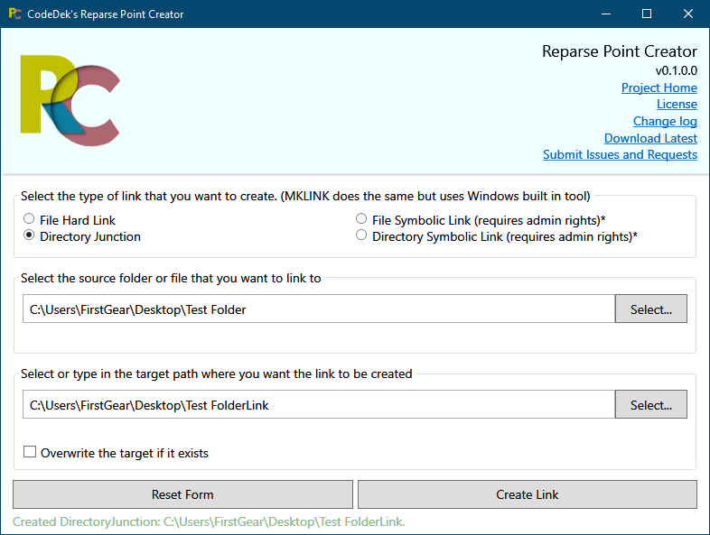

# CodeDek's Reparse Point Creator

Easily create [Symbolic Links](https://en.wikipedia.org/wiki/NTFS_symbolic_link), [Hard Links](https://en.wikipedia.org/wiki/Hard_link) and [Junction Points](https://en.wikipedia.org/wiki/NTFS_junction_point) in Windows.

Scroll down to the [downloads](#downloads) section to get a specific version and to view its [change log](#downloads), or just go to [releases](https://github.com/codedek/CodeDek.FolderSharer/releases) to get the latest.

### License & Copyright
© 2019 CodeDek. All Rights Reserved.

Licensed under the [GPL-3.0](LICENSE).

### Dependencies
- [.NET Framework 4.6.1](https://dotnet.microsoft.com/download/dotnet-framework/net461) (Required to be installed on your machine for this app to run.)

## Features
- Create Hard Links of files.
- Create Junctions of folders.
- Create Symbolic Links of files.
- Create Symbolic Links of folders.
### How to Create a Symbolic Link
1. Make sure that you have Admin rights (required for Symbolic Links, Wish MS would change that.)
2. Select the kind of Symbolic Link you want to create.
3. Select the Source that you'd like to link to.
4. Enter the path and name of the link/Target. (if it exists, check overwrite or change the name.)
5. Click the Create Link button.
6. Profit!

### How to Delete a Link
1. The same way you delete any other file. (delete button, right click delete etc.)

- The Reset Form button clears everything you changed on the form.

### Submit Issues or Requests
If you have any issues or requests, you can submit your [issues here](https://github.com/codedek/CodeDek.reparsepointcreator/issues).

### Downloads
[Version 1.0](https://github.com/codedek/CodeDek.reparsepointcreator/releases/tag/v1.0) **-** [Change log](CHANGELOG.md)

